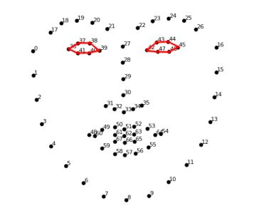
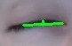

#Gaze-Controlled Keyboard
Inspired by a blog on how computer vision assists people with quadriplegia, I developed a gaze-controlled virtual keyboard using Python and OpenCV. The aim is to enable hands-free typing by tracking eye movements and blinks.

##Objective
Build a virtual keyboard that detects eye movements and blinking to type letters—helpful for users with limited mobility.

##Approach
The project is divided into two main components:
###Eye and Gaze Detection
###Virtual Keyboard Interface

##1. Eye and Gaze Detection
###1.1 Eye Landmark Detection

Using dlib’s 68 facial landmarks, the following points are used to detect eyes:
* Left eye points: (36, 37, 38, 39, 40, 41)

* Right eye points: (42, 43, 44, 45, 46, 47)

###1.2 Blinking Detection
To detect blinking, a ratio of horizontal to vertical eye distances is calculated:
If ratio > 5.5 → Eye is considered closed
This helps trigger actions based on intentional blinking.

Visual of eye when it is open.

Visual of eye when it is closed.

###1.3 Gaze Direction
To detect where the user is looking (left or right), we:
Divide the eye region into left and right halves
Count the white pixels (sclera) in each half

Calculate gaze_ratio = left_white / right_white
Gaze Ratio < 1 → Looking right
Gaze Ratio > 1.7 → Looking left

Here is how the virtual keyboard is divided

Hence, for that, we need to detect the gaze of our eyes. The possible directions of gaze are shown in the image below.

The idea is to split the eye in two parts and to find out in which of the two parts there is more sclera (white part of eye) visible.

This determines which side of the keyboard should be activated.

##2. Virtual Keyboard

###2.1 Interface Layout
The keyboard is split into left and right sections
Based on gaze direction, the corresponding side is activated

Using mathematical logic in NumPy and cv2 libraries, we create the keyboard.

This is a left-side keyboard.

###2.2 Key Selection via Blink
Letters highlight every 10 frames
A long blink (1+ second) selects the currently highlighted key
The selected key is displayed on a whiteboard with a beep sound
